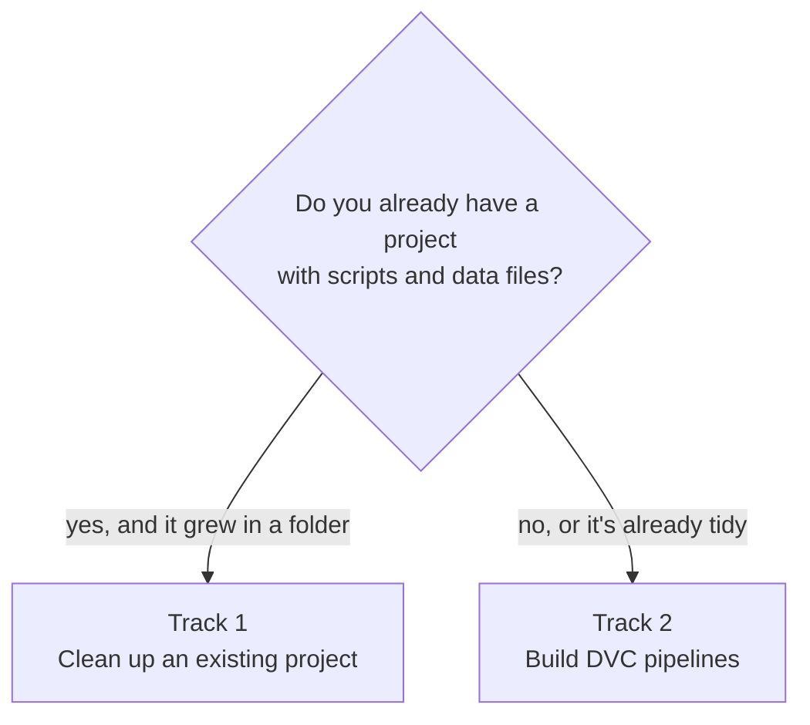

# Data Version Control for financial projects

A step-by-step tutorial on keeping your data versioned and your results reproducible, with risk
and rating pipelines built on DVC.

**How to start:** read why it matters (2 minutes), [choose your track](#choose-your-track), do the
[setup](docs/setup.md), and follow your track's links. Already convinced? Go straight to
[Choose your track](#choose-your-track).

## Why data version control matters

In finance, a number is only as good as your ability to explain where it came from.

Without version control, most teams end up with a folder like this:

```
client-portfolio.xlsx
client-portfolio_v2.xlsx
client-portfolio_v2_final.xlsx
client-portfolio_v2_final_JM.xlsx
client-portfolio_FINAL_use_this_one.xlsx
```

Nobody is sure which file fed last quarter's report, who changed what, or whether "final" is
really final. And sooner or later, someone asks a question like these:

- A client asks why a company's climate rating dropped from C to D between two releases.
  Was it new emissions data, a new carbon price, or a code change?
- An auditor asks to see the exact inputs behind the figures published in March.
- A colleague's results differ from yours. Are you using the same version of the market data?
- A calculation takes hours. You changed one setting. Do you really need to rerun everything?

Without version control, each question means hours of detective work, and sometimes there is no
answer at all, because the data behind a result was overwritten long ago.

**Data version control fixes this.** It gives you:

- **Every version, kept safely**, with who saved it, when, and a message saying why.
- **Any old version back** in one command, even years later.
- **One shared truth**: everyone works from the same version of the data.
- **Results you can rebuild exactly**, because each result is linked to the data, code and
  settings that produced it.
- **Less waiting**: when something changes, only the calculations it affects are rerun.

**Why not just git?** git does all this for code, but it's built for small text files. Financial
data is often gigabytes of Excel, CSV and Parquet files, and git becomes very slow, or refuses,
with files that size. **DVC** (Data Version Control) fills that gap: it gives data the same history
that git gives code, and it runs your calculations as a pipeline that knows what to rerun.

## Choose your track

The tutorial has two tracks. They share the same first pages, setup and reference pages: pick the
one that fits your work, and follow its links. You can do the other one later.

### Track 1: Clean up an existing project

- **For you if** your project grew in a folder: scripts, Excel inputs and results, files named
  `_V2` or `_final`, paths like `C:\Users\<name>\...`, or everything pushed to GitHub as it was.
- **You'll learn** to turn it into a repository anyone on the team can run: a clean layout,
  versioned data, a pipeline, and deliveries you can trace.
- **Time:** about 3 hours, plus the time to move your own files.
- **Pages:** [1](docs/1-how-dvc-works.md), [2](docs/2-practice-project.md) (steps 1 to 5 only),
  [4](docs/4-existing-project.md), [5](docs/5-worked-example.md) and [6](docs/6-good-habits.md).

**[Start track 1 →](docs/1-how-dvc-works.md)**

### Track 2: Build DVC pipelines

- **For you if** you're starting pipeline work, such as a risk model, ratings or scenario
  analysis, and you want results you can rebuild exactly, months later.
- **You'll learn** DVC pipelines: first on a practice project, then in a real repository with
  shared storage, several pipelines, releases and automatic checks.
- **Time:** about 2½ hours, or less if you're good at git.
- **Pages:** [1](docs/1-how-dvc-works.md), [2](docs/2-practice-project.md),
  [3](docs/3-your-own-project.md) and [6](docs/6-good-habits.md).

**[Start track 2 →](docs/1-how-dvc-works.md)**

### Not sure?



| Page | Track 1 | Track 2 |
|---|---|---|
| 1. [How DVC works](docs/1-how-dvc-works.md) (10 minutes) | ✓ | ✓ |
| 2. [Practice project](docs/2-practice-project.md) (1 hour) | Steps 1 to 5 | ✓ |
| 3. [DVC in your own project](docs/3-your-own-project.md) (1 hour) | | ✓ |
| 4. [Bring an existing project into git and DVC](docs/4-existing-project.md) (1 hour) | ✓ | |
| 5. [Worked example: from scripts to a pipeline](docs/5-worked-example.md) (45 minutes) | ✓ | |
| 6. [Good habits](docs/6-good-habits.md) (10 minutes) | ✓ | ✓ |

**Before you start, on both tracks:** do the [setup steps](docs/setup.md). **New to git?** Also
read [Git and uv basics](docs/git-and-uv-basics.md). It takes 15 minutes. "Good at git" means you
clone, commit, branch and open pull requests without thinking about it; if that's you, skip it.

## Going further

Three pages for when you've finished your track, or when one of these situations is yours:

- **[Track experiments with DVC](docs/experiments.md)** (45 minutes): you try many variations of a
  model. Replace a copy of the script per idea with one script and its settings, and compare every
  variation in one table.
- **[Replace a home-made runner with DVC](docs/replace-a-runner.md)** (45 minutes): your project has
  a `run_all.py` that runs everything in order. Let DVC do it, and rerun only what changed.
- **[A pipeline owned by several people](docs/several-owners.md)** (30 minutes): parts of your
  pipeline have different owners. Make the hand-offs safe, and send each change to the right
  reviewer.

## Reference pages

- [Set up your computer](docs/setup.md)
- [Git and uv basics](docs/git-and-uv-basics.md)
- [When something goes wrong](docs/troubleshooting.md)
- [Cheat sheet](docs/cheat-sheet.md)
- [Glossary](docs/glossary.md)
- Files to copy: the [practice project](practice-project/) and the [templates](templates/)

## Conventions

- Commands are for **Windows and PowerShell**. (On a Mac or Linux almost everything is the same.
  The one difference: end continued lines with `\` instead of a backtick.)
- Lines starting with `#` are comments: you don't type them.
- Text in angle brackets, like `<commit-id>`, is a placeholder: replace it, brackets included.
- Every page starts with a box: **who it's for**, **what you'll learn**, **how long it takes**, and
  **what to read first**. Long pages then list their sections, and every tutorial page ends with
  **In short**, a recap of what to remember.
- Boxes marked **Good at git** or **New to git** tell you what to skip or read closely.
- The line at the top of each page shows where you are, for example
  *Home › Track 1: Clean up an existing project › Page 4*.

---

*Questions or corrections: open an issue or a pull request on this repository.*
