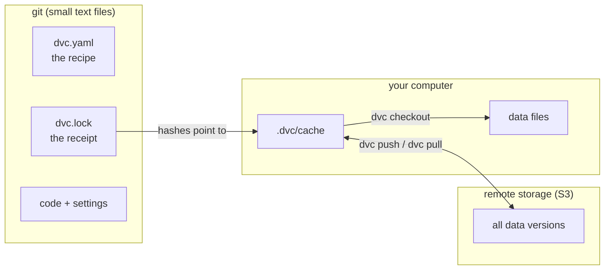
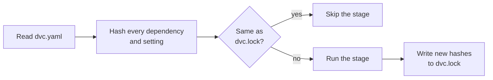

[Home](../README.md) › Both tracks › Page 1

# 1. How DVC works

> **For you if** you're new to DVC, on either track. This page explains the ideas; the next one puts them into practice.
>
> **You'll learn** the five ideas behind DVC: where data and code live, hashes, `dvc.yaml`, `dvc.lock`, and the cache and remote.
>
> **Time:** about 10 minutes.
>
> **Before this page:** steps 1 to 6 of [Setup](setup.md). New to git? Also read [Git and uv basics](git-and-uv-basics.md).

This page is the start of both tracks:

- **Track 1, clean up an existing project:** this page, the [practice project](2-practice-project.md)
  (steps 1 to 5), then pages [4](4-existing-project.md), [5](5-worked-example.md) and [6](6-good-habits.md).
- **Track 2, build DVC pipelines:** this page, the [practice project](2-practice-project.md), then
  pages [3](3-your-own-project.md) and [6](6-good-habits.md).

> **Used DVC before?** Skim this page and go to the [practice project](2-practice-project.md).

## The five ideas behind DVC

You only need five ideas to understand DVC.

**1. Git keeps the small files, storage keeps the big ones.**
Code, settings and small summary files live in git. Big data files live in separate storage.
In this tutorial it's Amazon S3, but DVC also works with Azure Blob Storage, Google Cloud Storage,
a network drive and more.

**2. A fingerprint for every file.**
DVC reads each data file and computes a short code from its content, called a *hash*
(DVC uses the MD5 method). It looks like `6645fac464949232a02816779c89ca59`. If even one byte of
the file changes, the hash changes completely. So the hash identifies one exact version of the data.

**3. The recipe: `dvc.yaml`.**
A list of steps, called *stages*. For each stage it says which command to run, what the stage
reads (its *dependencies*), which settings it uses (its *params*) and what it produces (its *outputs*).

**4. The receipt: `dvc.lock`.**
After a run, DVC writes down the hash of every dependency and output. This file is small, so it
lives in git. Checking out an old git commit gives you the old receipt, and the receipt tells DVC
exactly which data to fetch.

**5. Cache and remote.**
On your computer, DVC keeps a copy of each data version in a hidden folder called the *cache*
(`.dvc/cache`). The *remote* is the shared storage (S3) where everyone pushes and pulls these copies.

Here is how the pieces fit:

And here is what happens when you ask DVC to run the pipeline (`dvc repro`):

That second picture is the whole trick. DVC reruns a stage only when something it reads has
changed, and it knows what changed because it compares hashes.

## In short

- **git keeps the small files** (code, settings, receipts), **DVC storage keeps the data**.
- **A hash** is a fingerprint of a file's content: if one byte changes, the hash changes.
- **`dvc.yaml` is the recipe**, the list of stages. **`dvc.lock` is the receipt**: the hashes of what each run used and produced.
- **`dvc repro` reruns a stage only when something it reads has changed.**

---

[Next: Practice project](2-practice-project.md) →
