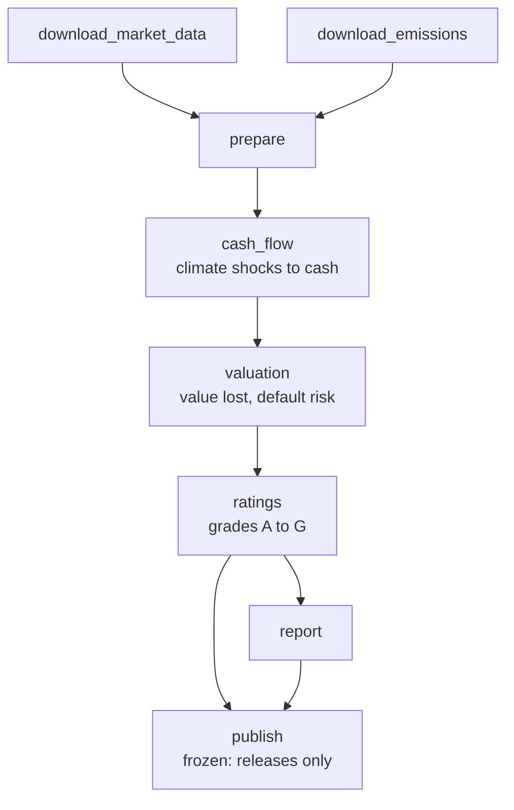

[Home](../README.md) › Track 2: Build DVC pipelines › Page 3

# 3. DVC in your own project

> **For you if** you're on track 2, and you want to use DVC in a real repository: shared storage, credentials, several people, and releases that must be rebuilt months later.
>
> **You'll learn** to add DVC to a repository, write a reliable pipeline, run several pipelines side by side, release versions, and check them automatically.
>
> **Time:** about 1 hour.
>
> **Before this page:** the whole [practice project](2-practice-project.md).

**On this page:**

- [1. The example project: greenfin-risk](#1-the-example-project-greenfin-risk)
- [2. Add DVC to an existing repository](#2-add-dvc-to-an-existing-repository)
- [3. Write the pipeline](#3-write-the-pipeline)
- [4. Several pipelines in one repository](#4-several-pipelines-in-one-repository)
- [5. Everyday tasks](#5-everyday-tasks)
- [6. Releases and old versions](#6-releases-and-old-versions)
- [7. Automatic checks](#7-automatic-checks)
- [8. Checklist for a new stage](#8-checklist-for-a-new-stage)

The practice project had three stages on a laptop. A real financial project has more stages,
shared cloud storage, credentials, several people, and releases that must be reproducible months
later. This page shows how to handle all of that, using an invented example project you can adapt.

The files used here are in the [`templates`](../templates/) folder of this repository, ready to copy.

## 1. The example project: greenfin-risk

*greenfin-risk* is a fictional climate credit-risk model for a bank's loan book. It answers:
"how much could climate change hurt each borrower, and what grade should it get?"

It has two portfolios, **corporate loans** and **project finance**. They share most of the code
but have different data, so each has its own pipeline, its own settings and its own storage.

```
C:\projects\greenfin-risk\
├── .dvc\config                  DVC settings: one remote per pipeline
├── .gitattributes               keeps metrics files byte for byte (section 2)
├── pyproject.toml, uv.lock      Python packages (see [Git and uv basics](git-and-uv-basics.md))
├── src\greenfin\                the code, shared by both pipelines
│   ├── download.py  prepare.py  cash_flow.py  valuation.py
│   ├── ratings.py   report.py   publish.py
│   └── common\                  shared formulas: discounting, carbon costs
├── pipelines\
│   ├── corporate\
│   │   ├── dvc.yaml             the recipe
│   │   ├── dvc.lock             the receipt
│   │   ├── config.yaml          the settings DVC watches
│   │   ├── .env                 credentials, never in git
│   │   ├── data\                stage outputs, managed by DVC
│   │   └── metrics\             small results, kept in git
│   └── project_finance\         the same layout
├── tools\run.py                 a small wrapper around DVC (section 4)
└── .github\workflows\           automatic checks (section 7)
```

The corporate pipeline:



Your project will look different, but most financial pipelines have the same shape: **download →
prepare → calculate → score → report → publish**.

## 2. Add DVC to an existing repository

> Someone does this **once per repository**, not once per person. If the repository you work on
> already has a `.dvc` folder, it's done: just set up your credentials (step 3 below), then go to
> [section 5](#5-everyday-tasks).

**1. Install DVC as a project package**, with S3 support, so everyone gets the same version:

```powershell
cd C:\projects\greenfin-risk
uv add "dvc[s3]"
uv run dvc init
Add-Content .gitattributes "**/metrics/** -text"   # keep metrics files byte for byte
git add .dvc .dvcignore .gitattributes pyproject.toml uv.lock
git commit -m "Add DVC"
```

If the repository has no `pyproject.toml` yet, run `uv init --bare` first to create one. For Azure
storage use `dvc[azure]`, for Google Cloud `dvc[gs]`.

The `.gitattributes` line matters on Windows. Metrics files are kept in git, and `dvc.lock`
records their hash. Git for Windows normally changes line endings when it checks files out, so
without this line a colleague's fresh clone shows every metrics file as modified. The same line
is in [`templates/gitattributes.txt`](../templates/gitattributes.txt).

**2. Create the storage.** Ask your cloud administrator for an S3 bucket (or a folder in an
existing one) and for read/write credentials. Then add one remote per pipeline:

```powershell
uv run dvc remote add corporate s3://greenfin-dvc/corporate
uv run dvc remote add project_finance s3://greenfin-dvc/project_finance
uv run dvc remote modify corporate region eu-west-1
uv run dvc remote modify project_finance region eu-west-1
git add .dvc/config
git commit -m "Add DVC remotes"
```

If your repository has **a single pipeline**, add one remote with `-d` to make it the default, and
you can skip the wrapper in section 4.

**3. Give DVC your credentials, without putting them in git.** Two common ways:

*Option A: an AWS profile (recommended).* Store your keys under a profile once
([Setup, step 4](setup.md#step-4--store-your-storage-keys)), then point each remote at it:

```powershell
uv run dvc remote modify --local corporate profile team
uv run dvc remote modify --local project_finance profile team
```

`--local` writes to `.dvc/config.local`, which git ignores. Each person uses their own profile.

*Option B: a `.env` file.* Put the keys in `pipelines\corporate\.env`:

```
AWS_ACCESS_KEY_ID=...
AWS_SECRET_ACCESS_KEY=...
```

Add `.env` to `.gitignore` (see [`templates/gitignore.txt`](../templates/gitignore.txt)), and commit
a `.env.example` with the key names but no values, so colleagues know what to fill in. DVC doesn't
read `.env` by itself, so run commands with `uv run --env-file pipelines\corporate\.env ...`.

**4. Check it works:**

```powershell
uv run dvc push --remote corporate    # nothing to push yet, but it must not say "403 Forbidden"
```

## 3. Write the pipeline

A full example is in [`templates/dvc.yaml`](../templates/dvc.yaml), with its settings in
[`templates/config.yaml`](../templates/config.yaml). The central stage looks like this:

```yaml
  cash_flow:
    cmd: python -m greenfin.cash_flow --portfolio corporate
    deps:
    - ../../src/greenfin/cash_flow.py      # its own code
    - ../../src/greenfin/common            # shared code it imports
    - data/prepared/companies.parquet      # the exact files it reads,
    - data/prepared/financials.parquet     # not the whole folder
    params:
    - config.yaml:
      - scenarios                          # only the settings it uses
      - carbon_prices
      - horizons
    outs:
    - data/cash_flow
    metrics:
    - metrics/cash_flow.json:
        cache: false                       # kept in git, visible in pull requests
```

Five patterns make a financial pipeline reliable. Each one is in the template.

**1. List exactly what each stage reads.** Every file a stage reads must be in its `deps`. If one
is missing, DVC won't rerun the stage when that file changes, and results go stale **without any
warning**. This is the most common DVC mistake. Listing individual files, like
`companies.parquet` above, instead of whole folders also avoids needless reruns.

**2. Depend on settings key by key.** `params` lists only the config keys a stage uses. Changing
`ratings.grades` then reruns `ratings` and `report`, and leaves the expensive `cash_flow` and
`valuation` alone.

**3. Pin your downloads.** DVC can't see inside a data provider's server, so a download stage
can't know when the provider has new data. Instead, give each download a *snapshot date* in
`config.yaml` and make the stage depend on it:

```yaml
  download_market_data:
    cmd: python -m greenfin.download market --portfolio corporate
    params:
    - config.yaml:
      - sources.market_data        # "2026-09-30"
    outs:
    - data/raw/market
```

The script downloads the snapshot for that date. To refresh, move the date. The download reruns,
everything after it reruns, and `dvc.lock` records exactly which snapshot every result used.

**4. Keep small results as metrics.** Coverage counts, average scores, the grade distribution:
put them in small JSON files with `cache: false`. Every pull request then shows how the numbers
moved, and `dvc metrics diff` compares any two versions.

**5. Freeze the publish stage.** `frozen: true` means `dvc repro` never runs it by accident. Only
your release process sends results to clients.

## 4. Several pipelines in one repository

When one repository holds several pipelines, as greenfin-risk does, two things can go wrong:

- a bare `dvc repro` at the repository root runs **every** pipeline, and
- a bare `dvc push` can send corporate data into the project-finance storage.

That's why the example has **no default remote**, and why it uses a small wrapper,
[`templates/run.py`](../templates/run.py), saved as `tools\run.py`. It always runs DVC inside one
pipeline's folder, with that pipeline's `dvc.yaml` and remote:

```powershell
uv run tools/run.py corporate status     # dvc status          in pipelines\corporate
uv run tools/run.py corporate dry        # dvc repro --dry
uv run tools/run.py corporate repro      # dvc repro
uv run tools/run.py corporate pull       # dvc pull --remote corporate
uv run tools/run.py corporate push       # dvc push --remote corporate
```

If you use `.env` files (option B in section 2), put `--env-file` in front:
`uv run --env-file pipelines\corporate\.env tools/run.py corporate pull`.

The wrapper is about 40 lines. Edit its `PIPELINES` list to match your folders.

## 5. Everyday tasks

### "I just need the latest results"

```powershell
git switch main
git pull
uv sync
uv run tools/run.py corporate pull
```

Your `data\` folders now match the current `dvc.lock` exactly. Nothing was recomputed.

### "I changed some code. What will rerun?"

```powershell
uv run tools/run.py corporate status     # which stages are affected
uv run tools/run.py corporate dry        # the exact list repro would run
uv run tools/run.py corporate repro      # run them
```

A change in `src\greenfin\common` reruns every stage that lists it: here `cash_flow`,
`valuation`, and everything after them.

### "I changed a setting"

Change it in `config.yaml`, then `status`. If you changed `valuation.discount_rate`, only
`valuation`, `ratings` and `report` are out of date. Compare the results before and after:

```powershell
uv run dvc params diff
uv run dvc metrics diff
```

### "I want to try an idea without disturbing anyone"

Work on a branch, exactly as in [Step 9](2-practice-project.md#step-9--try-an-idea-on-a-branch), and compare with
`uv run dvc metrics diff main`.

### "What do I commit after a run?"

Teams choose one of two rules. Pick one, write it in your README, and stick to it.

- **Rule A: commit results with the code.** Every pull request that changes results also commits
  `dvc.lock` and `metrics\`, and the author pushes the data. Simple, and `main` always matches its
  data. Good for small teams and research work.
- **Rule B: commit results only in releases.** Feature pull requests contain code only. Results are
  computed and committed on a release branch, reviewed, then tagged. Better when outputs go to
  clients or regulators, because every published number comes from one reviewed run.

With rule B, undo the run results before committing your code:

```powershell
git restore --staged --worktree -- pipelines/corporate/dvc.lock pipelines/corporate/metrics/
```

**Tip:** `uv run dvc config core.autostage true` makes DVC `git add` the files it changes. That's
convenient with rule A. With rule B, remember to undo them as shown above.

## 6. Releases and old versions

A release is a git tag on the commit whose `dvc.lock` produced the published results:

```powershell
git tag corporate/2026.09
git push origin corporate/2026.09
```

Because the tag fixes the receipt, and the receipt fixes the data, the release can always be
recovered. There are three ways, from biggest to smallest.

**The whole release, in its own folder**, without disturbing your current work:

```powershell
git worktree add ..\greenfin-2026.09 corporate/2026.09
cd ..\greenfin-2026.09
uv sync
uv run tools/run.py corporate pull
```

When you're done, go back to the main folder and run `git worktree remove ..\greenfin-2026.09`.

**One file, from the command line.** This works without cloning:

```powershell
uv run dvc get <repository-url> pipelines/corporate/data/ratings/ratings.csv `
  --rev corporate/2026.09 -o ratings_2026.09.csv
```

**One file, from Python**, for example to compare two releases in a notebook. Run it from inside
the repository:

```python
import io

import dvc.api
import pandas as pd

def ratings_at(tag: str) -> pd.DataFrame:
    raw = dvc.api.read(
        "pipelines/corporate/data/ratings/ratings.csv",
        rev=tag,
        remote="corporate",
        mode="rb",
    )
    return pd.read_csv(io.BytesIO(raw))

old = ratings_at("corporate/2026.06")
new = ratings_at("corporate/2026.09")
```

## 7. Automatic checks

A check that runs on every pull request catches a `dvc.lock` that doesn't match its code, settings
or data, for example when someone forgot to push. A ready-made GitHub Actions workflow is in
[`templates/dvc-check.yml`](../templates/dvc-check.yml). Save it as
`.github\workflows\dvc-check.yml` and add two repository secrets, `AWS_ACCESS_KEY_ID` and
`AWS_SECRET_ACCESS_KEY`. Its key lines are:

```yaml
uv run tools/run.py ${{ matrix.pipeline }} pull
uv run dvc status --quiet pipelines/${{ matrix.pipeline }}/dvc.yaml
```

`dvc status --quiet` prints nothing and fails if anything is out of date. With rule B from section 5,
run this check on release branches only, since feature branches are expected to be out of date.

## 8. Checklist for a new stage

1. Every file the stage reads is in `deps`: its code, the shared code it imports, and the exact
   input files.
2. Only the config keys it uses are in `params`.
3. Big outputs go under `data\`. Small results go under `metrics\` with `cache: false`.
4. `uv run tools/run.py <pipeline> dry` shows the new stage in the right place.
5. Run it, check the metrics, and commit according to your team's rule (section 5).

## In short

- **One remote per pipeline**, with your credentials kept outside git (an AWS profile or a `.env`).
- **A reliable stage** lists exactly what it reads, depends on settings key by key, pins its downloads, and keeps small results as metrics.
- **Several pipelines in one repository** need a wrapper, so each command hits the right pipeline and storage.
- **Agree on a commit rule, tag every release, and let a check run on every pull request.**

---

← [Previous: Practice project](2-practice-project.md) · [Next: Good habits](6-good-habits.md) →
