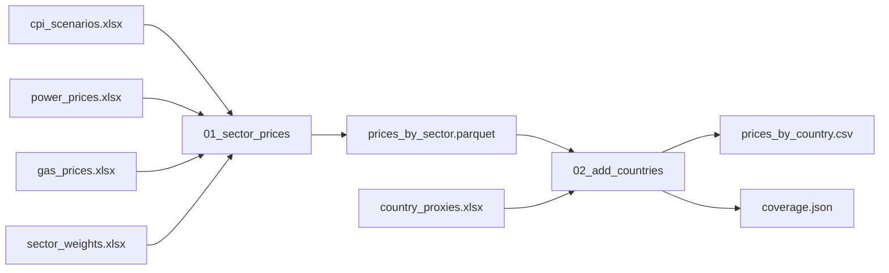

[Home](../README.md) › Track 1: Clean up an existing project › Page 5

# 5. Worked example: from scripts to a pipeline

> **For you if** you're on track 1, and your project now has a clean layout, but its results are still made by running scripts by hand.
>
> **You'll learn** to turn scripts into a DVC pipeline, so results are versioned, only what changed reruns, and every delivered file is recorded.
>
> **Time:** about 45 minutes.
>
> **Before this page:** [page 4](4-existing-project.md).

**On this page:**

- [1. What we start from](#1-what-we-start-from)
- [2. Put every setting in `config.yaml`](#2-put-every-setting-in-configyaml)
- [3. Make each script read from the config](#3-make-each-script-read-from-the-config)
- [4. Describe the pipeline in `dvc.yaml`](#4-describe-the-pipeline-in-dvcyaml)
- [5. Run it](#5-run-it)
- [6. Everyday changes](#6-everyday-changes)
- [7. Deliver a version, with a record](#7-deliver-a-version-with-a-record)
- [8. What changed](#8-what-changed)

On [page 4](4-existing-project.md), climate-price-paths got a clean layout, and its inputs were put
under DVC. Its results are still made by hand: someone runs the two scripts in the right order,
then uploads the final file to S3. This page turns the scripts into a DVC pipeline. The files are in
[`templates/climate-price-paths/`](../templates/climate-price-paths/), ready to adapt.

## 1. What we start from

Two scripts, run in this order:

1. **`scripts/01_sector_prices.py`** combines consumer-price, power-price and gas-price scenarios
   with sector weights, and projects price growth for every sector, region, scenario and year.
2. **`scripts/02_add_countries.py`** gives countries without their own projection the prices of a
   proxy region, and writes the final file that another team uses.



That picture *is* the pipeline. The rest of this page writes it down so DVC can run it.

## 2. Put every setting in `config.yaml`

Everything a script needs to know, apart from its code, goes here: file names, sheet names, and
choices such as the base year.

```yaml
inputs:
  cpi:     {file: data/raw/cpi_scenarios.xlsx,          sheet: CPI}
  power:   {file: data/raw/power_prices.xlsx,           sheet: Prices}
  gas:     {file: data/raw/gas_prices.xlsx,             sheet: Prices}
  weights: {file: data/reference/sector_weights.xlsx,   sheet: Weights}

sector_prices:
  base_year: 2025
  output: outputs/prices_by_sector.parquet

add_countries:
  proxies: {file: data/reference/country_proxies.xlsx, sheet: Proxies}
  output: outputs/prices_by_country.csv
```

## 3. Make each script read from the config

Both scripts share a small `scripts/helpers.py`, which finds the repository folder and reads
`config.yaml`, as on [page 4](4-existing-project.md#5-paths-that-work-on-every-computer):

```python
from pathlib import Path

import pandas as pd
import yaml

ROOT = Path(__file__).resolve().parents[1]   # the repository folder, on every computer

def load_config() -> dict:
    with open(ROOT / "config.yaml", encoding="utf-8") as f:
        return yaml.safe_load(f)

def read_input(spec: dict) -> pd.DataFrame:
    """Read an Excel input described in config.yaml as {file: ..., sheet: ...}."""
    return pd.read_excel(ROOT / spec["file"], sheet_name=spec["sheet"])
```

Each script then reads its inputs and writes its results exactly where `config.yaml` says. This is
the core of `02_add_countries.py`:

```python
from helpers import ROOT, load_config, read_input
import pandas as pd

config = load_config()
settings = config["add_countries"]

prices = pd.read_parquet(ROOT / config["sector_prices"]["output"])
proxies = read_input(settings["proxies"])

# Every country gets the rows of the region it is mapped to
result = proxies.merge(prices, on="region", how="inner")

output = ROOT / settings["output"]
output.parent.mkdir(exist_ok=True)
result.to_csv(output, index=False)
```

It also writes `metrics/coverage.json`: how many countries got prices, and which proxy regions had
none. That small file is kept in git, so every pull request shows whether coverage changed.

The complete, working scripts are in [`templates/climate-price-paths/`](../templates/climate-price-paths/).
Their calculation is a simple placeholder: keep the structure, and put your own calculation in.

The first script saves its result as **Parquet** rather than Excel: it's much smaller and faster
for a file only the next script reads. Add the package once with `uv add pyarrow`. The final file
keeps the format the other team needs, here CSV.

## 4. Describe the pipeline in `dvc.yaml`

Create `dvc.yaml` at the repository root. Each stage lists exactly what it reads and what it
writes:

```yaml
stages:
  sector_prices:
    cmd: python scripts/01_sector_prices.py
    deps:
    - scripts/01_sector_prices.py
    - scripts/helpers.py
    - data/raw/cpi_scenarios.xlsx
    - data/raw/power_prices.xlsx
    - data/raw/gas_prices.xlsx
    - data/reference/sector_weights.xlsx
    params:
    - config.yaml:
      - inputs
      - sector_prices
    outs:
    - outputs/prices_by_sector.parquet

  add_countries:
    cmd: python scripts/02_add_countries.py
    deps:
    - scripts/02_add_countries.py
    - scripts/helpers.py
    - outputs/prices_by_sector.parquet
    - data/reference/country_proxies.xlsx
    params:
    - config.yaml:
      - add_countries
    outs:
    - outputs/prices_by_country.csv
    metrics:
    - metrics/coverage.json:
        cache: false
```

Read it next to the diagram in section 1: each arrow into a box is a `deps` line, and each arrow
out of it is an `outs` line. The line `outputs/prices_by_sector.parquet` appears twice, as an
output of the first stage and an input of the second: that's how DVC knows the order.

The **execution order is now written down**. Nobody needs to remember to run `01` before `02`, or
to read the README to find out.

## 5. Run it

```powershell
uv run dvc repro
```

DVC runs `sector_prices`, then `add_countries`, and writes `dvc.lock`, the receipt. You should see
each stage announced, followed by its script's own message, something like:

```text
Running stage 'sector_prices':
> python scripts/01_sector_prices.py
Wrote outputs\prices_by_sector.parquet: 16 rows
...
Running stage 'add_countries':
> python scripts/02_add_countries.py
Wrote outputs\prices_by_country.csv: 24 rows
```

The number of rows depends on your data. Check the result:

```powershell
uv run dvc dag            # draws the pipeline in the terminal
uv run dvc metrics show   # prints coverage.json
```

Save everything:

```powershell
git add dvc.yaml dvc.lock config.yaml metrics outputs/.gitignore
git commit -m "Run the price projection as a DVC pipeline"
uv run dvc push
git push
```

The results are now versioned too. A colleague gets them with `uv run dvc pull`, without
running anything.

## 6. Everyday changes

**You received a new version of an input**, for example updated gas-price scenarios. Replace the
file, keeping its name, then record it and rerun:

```powershell
uv run dvc add data/raw
uv run dvc repro
uv run dvc metrics diff
```

Both stages rerun, because both depend, directly or through `prices_by_sector.parquet`, on the
gas prices. Commit `data/raw.dvc`, `dvc.lock` and `metrics`, then `dvc push` and `git push`.

**You changed a mapping**, for example one proxy region in `country_proxies.xlsx`:

```powershell
uv run dvc add data/reference
uv run dvc repro
```

Only `add_countries` reruns. `sector_prices` doesn't read that file, so DVC skips it: on a big
projection, that saves real time.

**You changed a setting**, for example `base_year` in `config.yaml`: just `uv run dvc repro`. DVC
sees that the `sector_prices` settings changed, and reruns from there.

**You changed code**: `uv run dvc status` tells you which stages are affected before you run
anything.

## 7. Deliver a version, with a record

Before, the final file was uploaded to S3 by hand, and nobody could say later which version had
been delivered. There are two good ways to fix that.

**Option A: the other team gets it from the repository.** Tag the commit you deliver, and push the
tag:

```powershell
git tag prices-2026.10
git push origin prices-2026.10
```

The other team then downloads exactly that version, at any time:

```powershell
uv run dvc get <repository-url> outputs/prices_by_country.csv --rev prices-2026.10
```

Nothing is copied by hand, and the tag is the record.

**Option B: the other team reads it from an S3 folder.** Use a small script that copies the file
to a **new folder per version**, and refuses to overwrite one that exists:
[`templates/climate-price-paths/publish_version.py`](../templates/climate-price-paths/publish_version.py).
Add its settings to `config.yaml`:

```yaml
publish:
  file: outputs/prices_by_country.csv
  bucket: your-company-bucket
  prefix: climate-price-paths/deliveries
```

Then deliver:

```powershell
uv run python scripts\publish_version.py 2026.10
```

The script:

1. stops if anything is uncommitted, or if the pipeline isn't up to date (`dvc status`), so you
   can only deliver results that match the code;
2. stops if the version folder already exists on S3, so a delivered version never changes;
3. uploads the file to `s3://your-company-bucket/climate-price-paths/deliveries/2026.10/`;
4. adds a line to `deliveries.csv`: the date, the version, the S3 path and the git commit.

Commit `deliveries.csv` and tag the commit, as in option A:

```powershell
git add deliveries.csv
git commit -m "Deliver prices 2026.10"
git tag prices-2026.10
git push
git push origin prices-2026.10
```

Option A is simpler and needs no S3 permissions for writing. Choose B when the other team can't
use DVC, or already reads from S3.

## 8. What changed

| Before | After |
|---|---|
| Run `01`, then `02`, and remember the order | `uv run dvc repro`, in the right order every time |
| Rerun everything after any change, to be safe | DVC reruns only what the change affects |
| `results_final.xlsx`, `results_final_v2.xlsx` | One output name; DVC keeps every version |
| Upload to S3 by hand | A tagged release, or a versioned folder with a record |
| "Which inputs made the file we sent in March?" | `git checkout prices-2026.03` and `uv run dvc pull` |

## In short

- **The diagram of what each script reads and writes is the pipeline.** `dvc.yaml` writes it down, so nobody has to remember the order.
- **Each script reads its file names from `config.yaml`** and writes its results exactly where the config says.
- **`dvc repro` reruns only the stages a change affects**, whether it's new data, a mapping, a setting or code.
- **Deliver with a record:** a git tag the other team reads with `dvc get`, or a versioned S3 folder logged in `deliveries.csv`.

---

← [Previous: Bring an existing project into git and DVC](4-existing-project.md) · [Next: Good habits](6-good-habits.md) →
